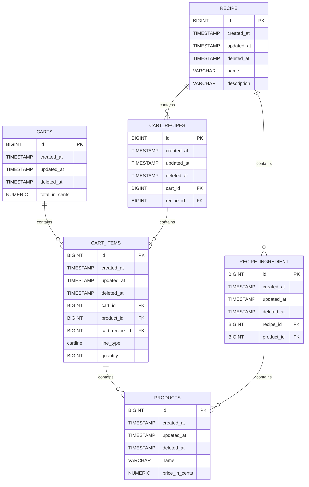

## Prerequisite
  - Java 21
  - docker

## Running the application on your local machine

To begin, you need to start up the postgres db with docker compose

First *cd* into the working directory then run the below command
```bash
  docker compose up -d
  
 ```

Run the test to make sure all passes with the below command
```bash
    mvn clean test
 ```


Then start the application with the below command
```shell
    ./mvnw spring-boot:run
```

### API Test Automation Stack
This application implements a robust end-to-end API testing framework combining:

- RestAssured: For streamlined HTTP requests and response validation
- Cucumber (BDD): For behavior-driven test scenarios in Gherkin syntax
- Testcontainers

#### Key features of our API testing solution:

- Behavior-Driven Development (BDD) Approach
    - Feature files written in business readable Gherkin syntax
    - Step definitions mapping to API test operations
- Comprehensive API Validation
    - Status code assertions
    - Response assertions
    - Schema validation (JSON Schema)


#### Running the cucumber test alone
```bash
    mvn clean test -P cucumber-tests cluecumber-report:reporting
```

#### Running the Unit test alone
```bash
  mvn clean test -P unit
```

### DATA MODEL


